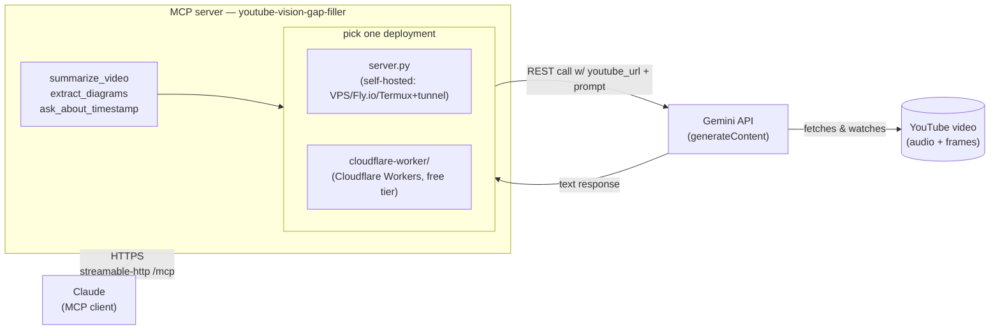

# youtube-vision-mcp

An MCP server that lets Claude watch YouTube videos using Gemini's native
video understanding — extracting diagrams, summaries, and timestamped
insights that transcript-only tools miss.

It calls Google AI Studio's Gemini API, which can natively ingest a YouTube
URL (audio + sampled video frames), and exposes that as MCP tools any MCP
client can call.

---

## Architecture



---

## Setup

### 1. Install dependencies
```bash
pip install -r requirements.txt
```

### 2. Save your Gemini API key
Get a key from https://aistudio.google.com/apikey then:
```bash
mkdir -p ~/.config/youtube-vision-mcp
echo "GEMINI_API_KEY=your-actual-key-here" > ~/.config/youtube-vision-mcp/.env
chmod 600 ~/.config/youtube-vision-mcp/.env
```

### 3. Run
```bash
python server.py
```

This starts a `streamable-http` MCP server on `0.0.0.0:8000` (endpoint
`/mcp`), so it can run as a remote MCP server reachable over HTTPS.

---

## Deploying

Run this somewhere reachable over HTTPS — a VPS, Fly.io, Render, a
Cloudflare Tunnel, etc. — and register it as a Custom Connector in
Claude → Settings → Connectors. Any MCP client only needs the URL, not
local execution, so mobile apps can use it too.

Set `GEMINI_API_KEY` (and optionally `GEMINI_MODEL`) as environment
variables on the host, or via `~/.config/youtube-vision-mcp/.env` — see
`.env.example`.

---

## Current state

Two interchangeable server implementations exposing the same three tools:

- `server.py` — a single-file Python MCP server over `streamable-http`,
  meant to be run locally or on whatever HTTPS-reachable host you choose.
- [`cloudflare-worker/`](cloudflare-worker/) — a TypeScript port deployed
  and live on Cloudflare's free Workers tier at a stable `*.workers.dev`
  URL. No tunnel, no restart-to-get-a-new-URL problem.

## Next steps

- Alternatives worth a look if a Python-native host is preferred:
  Fly.io (small always-on VMs, no cold start), Oracle Cloud's always-free
  ARM tier, or Render (free but spins down after 15 min idle, which is
  a poor fit for an MCP server clients expect to be always reachable).

---

## MCP tools exposed

| Tool | What it does |
|------|-------------|
| summarize_video(youtube_url) | Full summary + timestamped outline + key takeaways |
| extract_diagrams(youtube_url) | Finds all diagrams/slides, describes them, outputs Mermaid code |
| ask_about_timestamp(youtube_url, timestamp, question) | Targeted question about a specific moment |

---

## Example Claude prompts

```
Use youtube-vision-gap-filler to extract diagrams from https://youtu.be/MrD9tCNpOvU
```

```
Use youtube-vision-gap-filler to summarize https://youtu.be/MrD9tCNpOvU
```

```
Use youtube-vision-gap-filler to ask about timestamp 12:45 in https://youtu.be/MrD9tCNpOvU — what diagram is shown at that point?
```
